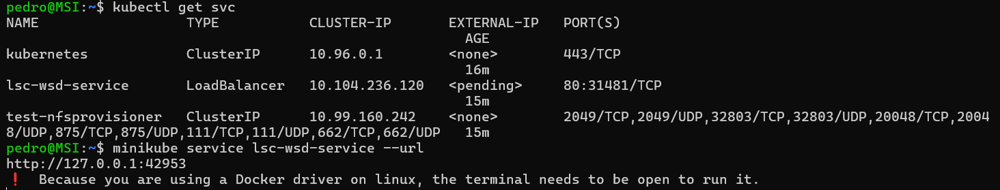

# Results

After deploying the application according to steps provided in *README.md* the result is a working nginx deployment with a load balancer service. The exposed service, list of pods and the web page can be seen on below figures. The source code can be found here https://github.com/MiZuii/LSC-lab6#





# Explanation of deployment process

The application uses helm to automate the deployment process. If one were to do it by hand the steps would need to be as follows:

## Install minikube and helm
Using the commands presented in *README.md* minikube and helm needs to be installed.

## Install *nfs-server-provisioner*
```
helm install nfs-server-provisioner \
  nfs-ganesha-server-and-external-provisioner/nfs-server-provisioner \
  --set=... \ 
  --set=... \
```
Where each set argument overrides default values according to **nfsprovisioner** section of `/lsc-wsd/values.yaml`

## Apply yaml files
Than each yaml file in directory `/lsc-wsd/templates` needs to be applied to the cluster. Before that they need to be populated by values from `/lsc-wsd/values.yaml`. One can do it by had or use the `helm template lsc-wsd` command which runs just the template engine and outputs a yaml to be applied. The yamls have proper dependencies and hooks, nontheless the preferable order for applying would be:

 + pvc.yaml
 + deployment.yaml
 + job.yaml
 + service.yaml

Applying is done by issuing the command `kubectl apply -f <the yaml to apply>`

# Architecture

## Diagram


## Explanation
### Storage Class
Storage Class is an identifyier created by *nfs-server-provisioner*. It denotes a class of storage which is provisioned dynamicly by the provisioner responsible for this Storage Class. When a **PVC** is created with this class as the StorageClass a request to *nfs-server-rpvisioner* is issued to create a **PV** with given parameters.

### Persistent Volume
A Persistent Volume is a piece of storage in the cluster that has been provisioned by an administrator or dynamically provisioned using Storage Class. In this application the **PV** is created dynamically.

### Persistent Volume Claim
Persistent Volume Claim is a request for storage by a user. Claims can request specific size and access modes (e.g., they can be mounted once read/write or many times read-only).

### Pod
A Pod is the basic building block of Kubernetes. Pods run the containers. A Pod encapsulates an application’s container (or, in some cases, multiple containers), storage resources, and a network identity.

In this application each pod runs one container with nginx server.

### Deployment
A Deployment is a Kubernetes object that manages replicated applications. Deployments manage Pods, creating, updating, and deleting them.

### Service
A Service is a way to expose an application running on a set of Pods as a network service. A Service abstracts away the underlying Pods and provides a stable endpoint for accessing the application.

### Job
A job is an instance representing some small computations. It is a sort of short lived pod which goal is to perform some one time action.

<!-- command used to generate the pdf -->
<!-- pandoc -f markdown-implicit_figures -V geometry:margin=1in raport.md -o lab6-raport.pdf -->
